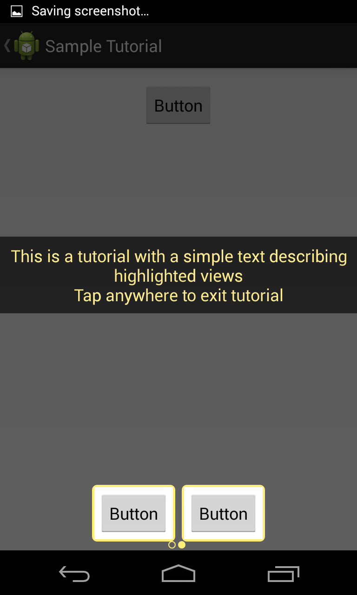

TutorialView
============

Highlight the new features or best parts of your Android App and guide new users

&nbsp;

Contains 2 modules

1. TutorialViewLibrary (com.ak.android.tutorialview) which is an Android Library
2. TutorialViewSampleApp - A sample app showing how to use the above library

<h3> TutorialBuilder </h3>

Build your tutorial using the TutorialBuilder class by passing one or more tutorial items. Sample code below:
~~~
private void showTutorial(){
        TutorialBuilder builder = new TutorialBuilder(this);

        ViewHighlighterCustomViewTutorialItem tutItem1 = new ViewHighlighterCustomViewTutorialItem(
                this,
                R.id.button1,
                R.layout.tutorial_custom_layout
        );
        ViewHighlighterTutorialItem tutItem2 = new ViewHighlighterTutorialItem(
                this,
                R.string.tut_page2_desc,
                R.id.button2, R.id.button3
        );
        builder.setTutId(1)
                .setForce(true)
                .addTutItem(tutItem1)
                .addTutItem(tutItem2)
                .build()
                .run();
    }
~~~

Each tutorial needs a unique Id - set via <b>setTutId(int)</b> 

By default the tutorial is shown only once on the first run unless it is forced using <b>setForce(boolean)</b>

<h3> TutorialItem </h3>

Currently there is support for 2 types of tutorial items

1) ViewHighlighterTutorialItem - A simple help text overlay highlighting required views and a central aligned text describing the highlighted view

~~~
ViewHighlighterTutorialItem tutItem2 = new ViewHighlighterTutorialItem(
                this, //activity object
                R.string.tut_page2_desc, // string resource id describing the highlighed view
                R.id.button2, R.id.button3 // view resource ids of views to be highlighted
        );
~~~

2) ViewHighlighterCustomViewTutorialItem - A custom layout help overlay over highlighted views
~~~
ViewHighlighterCustomViewTutorialItem tutItem1 = new ViewHighlighterCustomViewTutorialItem(
                this, //activity object
                R.id.button1, // view resource id to highlight
                R.layout.tutorial_custom_layout // layout resource id to be shown as help over highlighted view
        );
~~~

